# terminus-est

> Resolution and a plan are better than a sword, because a man whets his own edges on them.
> > Gene Wolfe - The Citadel of the Autarch

---

## Background
Terminus Est is a ergonomic (but somewhat conventional) split keyboard tuned to my developer workflow.
I've tended to cluster my actions around vim-inpsired keybindings with discrete "leader" keys, and started to wish that my leader keys were a bit easier to hit.
Rather than using stabilizers with longer keys, I've decided to use multiple 1U keys in some places, mostly for aesthetics. However, the keymapping may change in the future.

This project was frustratingly complicated, too expensive, and ultimately worse than my perfectly fine, working keyboards. But it's worth it to build something cool.

Thanks to @dededecline for the great advice and @kh3dron for making the plate look nice when I couldn't figure out the CAD stuff.

---

## Gallery

PCB

### Front

### Back

### Traces

Layout

Plate

Case

---

## Pinout

```mermaid
graph LR
    subgraph Columns["Columns"]
        COL0["COL0"]
        COL1["COL1"]
        COL2["COL2"]
        COL3["COL3"]
        COL4["COL4"]
        COL5["COL5"]
        COL6["COL6"]
        COL7["COL7"]
        COL8["COL8"]
        COL9["COL9"]
        COL12["COL12"]
        COL13["COL13"]
        COL14["COL14"]
        COL15["COL15"]
        COL16["COL16"]
        COL17["COL17"]
        COL18["COL18"]
        COL19["COL19"]
        COL20["COL20"]
        COL21["COL21"]
    end

    subgraph RPi["Raspberry Pi Pico"]
        GP0["GP0"]
        GP1["GP1"]
        GP2["GP2"]
        GP3["GP3"]
        GP4["GP4"]
        GP5["GP5"]
        GP6["GP6"]
        GP7["GP7"]
        GP8["GP8"]
        GP9["GP9"]
        GP10["GP10"]
        GP11["GP11"]
        GP12["GP12"]
        GP13["GP13"]
        GP14["GP14"]
        GP15["GP15"]
        GP16["GP16"]
        GP17["GP17"]
        GP18["GP18"]
        GP19["GP19"]
        GP20["GP20"]
        GP21["GP21"]
        GP22["GP22"]
        GP26["GP26"]
        GP27["GP27"]
        GP28["GP28"]
    end

    subgraph Rows["Rows"]
        ROW0["ROW0"]
        ROW1["ROW1"]
        ROW2["ROW2"]
        ROW3["ROW3"]
        ROW4["ROW4"]
        ROW5["ROW5"]
    end

    GP0 --> COL0
    GP1 --> COL1
    GP2 --> COL2
    GP3 --> COL3
    GP4 --> COL4
    GP5 --> COL5
    GP6 --> COL6
    GP7 --> COL7
    GP8 --> COL8
    GP9 --> COL9
    GP16 --> COL12
    GP17 --> COL13
    GP18 --> COL14
    GP19 --> COL15
    GP20 --> COL16
    GP21 --> COL17
    GP22 --> COL18
    GP26 --> COL19
    GP27 --> COL20
    GP28 --> COL21

    GP10 --> ROW0
    GP11 --> ROW1
    GP12 --> ROW2
    GP13 --> ROW3
    GP14 --> ROW4
    GP15 --> ROW5
```

---

## Built With

- [Raspberry Pi Pico](https://www.raspberrypi.com/products/raspberry-pi-pico/)
- [KLE (Keyboard Layout Editor)](http://www.keyboard-layout-editor.com/)
- [KiCad](https://www.kicad.org/)
- [Fusion 360](https://www.autodesk.com/products/fusion-360/)
- [keyboard-tools.xyz](https://keyboard-tools.xyz/)
- [kbplate (ai03)](https://kbplate.ai03.com/)
- [KMK Firmware](https://github.com/KMKfw/kmk_firmware)
- [OpenSCAD](https://openscad.org/)
