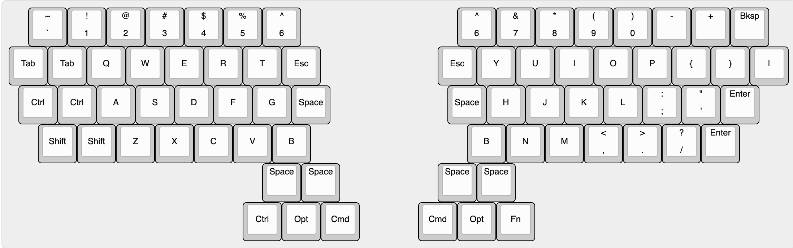

# terminus-est

> Resolution and a plan are better than a sword, because a man whets his own edges on them.
> > Gene Wolfe - The Citadel of the Autarch

## Background 
Terminus Est is a ergo-inspired keyboard tuned to my developer workflow.
I've tended to cluster my actions around vim-inpsired keybindings with discrete "leader" keys, and started to wish that my leader keys were a bit easier to hit.

It's 100% open source, so you can go build and/or modify it yourself!

## Key Features
- Split design for comfortability.
- Mirrored center column keys for ultimate flexibility.
- Thumb clustered "leader" keys.
- Additional `<Esc>` and `<Space>` placements for additional ease-of-use.

## Built With...
- https://keyboard-layout-editor.com/#/
- https://kbfirmware.com/
