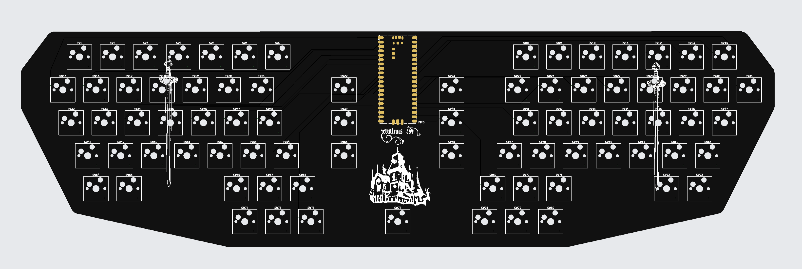
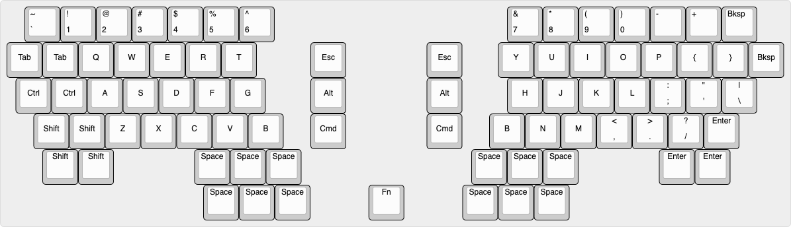

# terminus-est

> Resolution and a plan are better than a sword, because a man whets his own edges on them.
> > Gene Wolfe - The Citadel of the Autarch




## Background 
Terminus Est is a ergo-inspired keyboard tuned to my developer workflow.
I've tended to cluster my actions around vim-inpsired keybindings with discrete "leader" keys, and started to wish that my leader keys were a bit easier to hit.

This project was frustratingly complicated, too expensive, and ultimately worse than my perfectly fine, working keyboards. But it's worth it to build something cool.

## Key Features
- Split design for comfortability.
- Thumb clustered "leader" keys.

## Pinout
```csv
PinNumber,Side,Type,Assignment
1,Left,GP0,COL0
2,Left,GP1,COL1
3,Left,GND,None
4,Left,GP2,COL2
5,Left,GP3,COL3
6,Left,GP4,COL4
7,Left,GP5,COL5
8,Left,GND,None
9,Left,GP6,COL6
10,Left,GP7,COL7
11,Left,GP8,COL8
12,Left,GP9,COL9
13,Left,GND,None
14,Left,GP10,ROW0
15,Left,GP11,ROW1
16,Left,GP12,ROW2
17,Left,GP13,ROW3
18,Left,GND,None
19,Left,GP14,ROW4
20,Left,GP15,ROW5
21,Right,GP16,COL12
22,Right,GP17,COL13
23,Right,GND,None
24,Right,GP18,COL14
25,Right,GP19,COL15
26,Right,GP20,COL16
27,Right,GP21,COL17
28,Right,GND,None
29,Right,GP22,COL18
30,Right,RUN,None
31,Right,GP26,COL19
32,Right,GP27,COL20
33,Right,GND/AGND,None
34,Right,GP28,COL21
35,Right,ADC-VREF,None
36,Right,3V3(OUT),None
37,Right,VSYS,None
38,Right,GND,None
39,Right,VBUS,None
40,Right,VSYS,None
```
